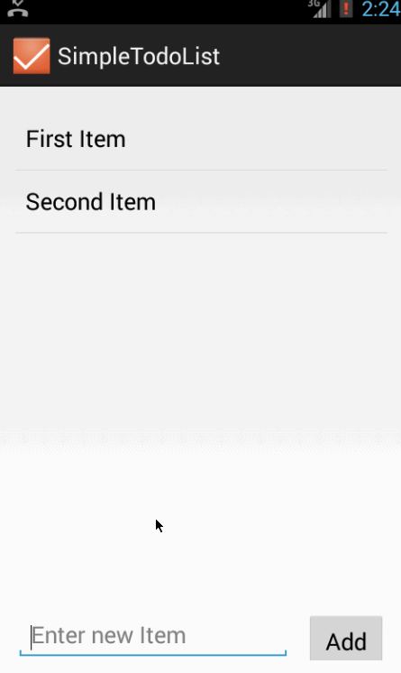

# Simple Todo List Demo

This is an Android application for todo list.

Time spent: 3 hours spent in total

Completed user stories:

 * [x] Required: User can view a list of existing todo items
 * [x] Required: User can add a new item to the todo list
 * [x] Required: User can remove an item from the todo list
 * [x] Required: The app can read and save todo list information to local file.

Walkthrough of all user stories:

GIF created with [LiceCap](http://www.cockos.com/licecap/).
